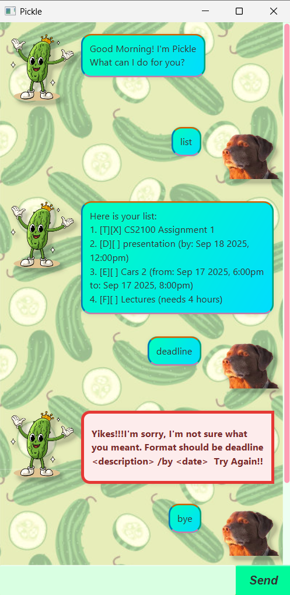

# Pickle User Guide

Welcome to **Pickle**!  
Pickle is a simple, friendly chatbot that helps you keep track of your tasks.

## Getting Started

1. Ensure you have **Java 11 or above** installed on your computer.
2. Download the latest `pickle.jar` release from this repository.
3. Open a terminal / command prompt in the folder containing the JAR.
4. Run the app.
5. You should see the welcome message:
>Good Morning! I'm Pickle
>What can I do for you?

## Features

### Add a Todo
Adds a simple task without any date/time attached.  
**Format:**  
`todo <description>`  
**Example:**  
`todo read book`

### Add a Deadline
Adds a task that must be completed by a specific date.  
**Format:**  
`deadline <description> /by <yyyy-mm-dd> HHmm`  
**Example:**  
`deadline submit assignment /by 2025-09-30 1800`

### Add an Event
Adds a task that happens at a specific time or date.  
**Format:**  
`event <description> /from <yyyy-mm-dd HHmm> /to <yyyy-mm-dd HHmm>`  
**Example:**  
`event project meeting /from 2025-09-20 1800 /to 2025-09-20 2000`

### Add a fixed duration task
Adds a task that requires a specific duration to be done.  
**Format:**  
`fixed <description> /for <duration in hours>`  
**Example:**  
`fixed assignment /for 5`

### List All Tasks
Displays the full list of tasks currently stored.  
**Format:**  
`list`

### Mark a Task as Done
Marks a task as completed.  
**Format:**  
`mark <task number>`  
**Example:**  
`mark 2`

### Unmark a Task
Marks a task as not done (undoes a mark).  
**Format:**  
`unmark <task number>`  
**Example:**  
`unmark 2`

### Delete a Task
Removes a task from the list.  
**Format:**  
`delete <task number>`  
**Example:**  
`delete 3`

### Find Tasks by Keyword
Shows tasks that contain the given keyword.  
**Format:**  
`find <keyword>`  
**Example:**  
`find book`

### Saving
Pickle data are saved in the hard disk 
automatically within a folder called 'data' 
after any command that changes
the data. There is no need to save manually.

### Exit the Program
Closes the chatbot.  
**Format:**  
`bye`

### Error Handling
If you type something invalid, Pickle will warn you.  
**Example:**  
Input: `foo bar`  
Output: `Yikes!!! foo bar  Try Again!!`

## Command Summary

| Action             | Format, Examples                                                                                     |
|--------------------|------------------------------------------------------------------------------------------------------|
| **Todo**           | `todo DESCRIPTION` e.g., `todo read book`                                                         |
| **Deadline**       | `deadline DESCRIPTION /by yyyy-mm-dd HHmm` e.g., `deadline submit report /by 2025-09-30 1800`     |
| **Event**          | `event <description> /from <yyyy-mm-dd HHmm> /to <yyyy-mm-dd HHmm>` e.g., `event project meeting /from 2025-09-20 1800 /to 2025-09-20 2000`         |
| **Fixed**          | `fixed <description> /for <duration in hours>` e.g., `fixed assignment /for 5`         |
| **List**           | `list`                                                                                               |
| **Mark**           | `mark INDEX` e.g., `mark 2`                                                                       |
| **Unmark**         | `unmark INDEX` e.g., `unmark 2`                                                                   |
| **Delete**         | `delete INDEX` e.g., `delete 3`                                                                   |
| **Find**           | `find KEYWORD` e.g., `find book`                                                                  |
| **Exit**           | `bye`                                                                                                |
| **Error Handling** | Invalid commands will trigger an error message. e.g., `foo bar` → `Yikes!!! foo bar  Try Again!!` |