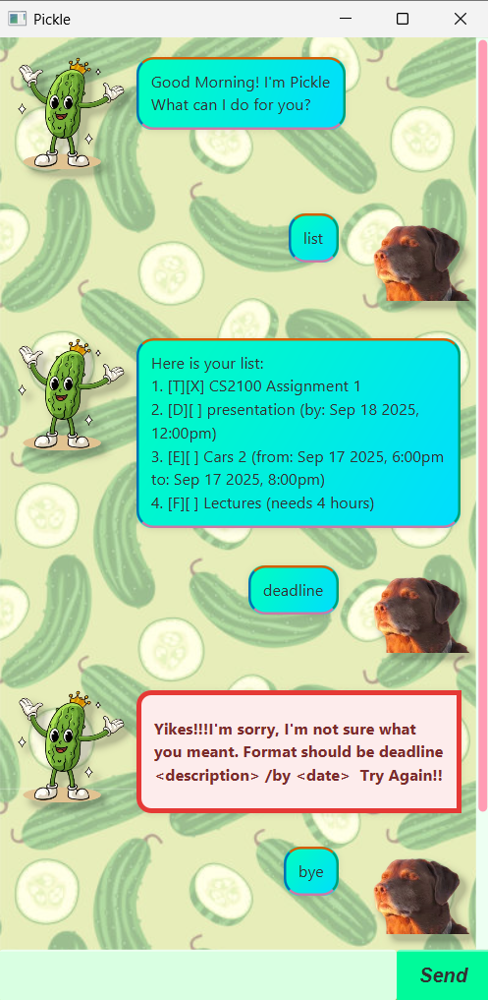

# Pickle User Guide

Welcome to **Pickle**!  
Pickle is a simple, friendly chatbot that helps you keep track of your tasks.

## Getting Started

1. Ensure you have **Java 11 or above** installed on your computer.
2. Download the latest `pickle.jar` release from this repository.
3. Open a terminal / command prompt in the folder containing the JAR.
4. Run the app.
5. You should see the welcome message:
>Good Morning! I'm Pickle
>What can I do for you?

## Features

### Add a Todo
Adds a simple task without any date/time attached.  
**Format:**  
`todo <description>`  
**Example:**  
`todo read book`

### Add a Deadline
Adds a task that must be completed by a specific date.  
**Format:**  
`deadline <description> /by <yyyy-mm-dd> HHmm`  
**Example:**  
`deadline submit assignment /by 2025-09-30 1800`

### Add an Event
Adds a task that happens at a specific time or date.  
**Format:**  
`event <description> /at <yyyy-mm-dd HHmm>`  
**Example:**  
`event project meeting /at 2025-09-20 1800`

### Add a fixed duration task
Adds a task that requires a specific duration to be done.  
**Format:**  
`fixed <description> /for <duration in hours>`  
**Example:**  
`fixed assignment /for 5`

### List All Tasks
Displays the full list of tasks currently stored.  
**Format:**  
`list`

### Mark a Task as Done
Marks a task as completed.  
**Format:**  
`mark <task number>`  
**Example:**  
`mark 2`

### Unmark a Task
Marks a task as not done (undoes a mark).  
**Format:**  
`unmark <task number>`  
**Example:**  
`unmark 2`

### Delete a Task
Removes a task from the list.  
**Format:**  
`delete <task number>`  
**Example:**  
`delete 3`

### Find Tasks by Keyword
Shows tasks that contain the given keyword.  
**Format:**  
`find <keyword>`  
**Example:**  
`find book`

### Exit the Program
Closes the chatbot.  
**Format:**  
`bye`

### Error Handling
If you type something invalid, Pickle will warn you.  
**Example:**  
Input: `foo bar`  
Output: `Yikes!!! foo bar  Try Again!!`